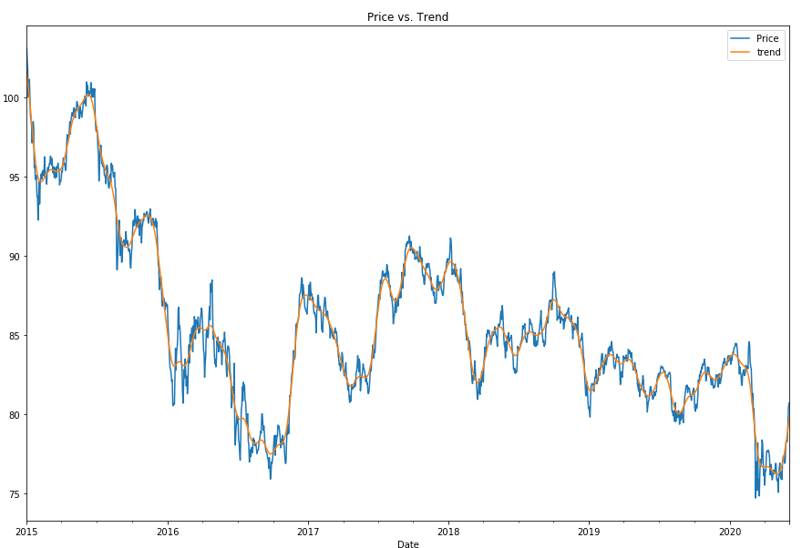
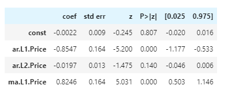
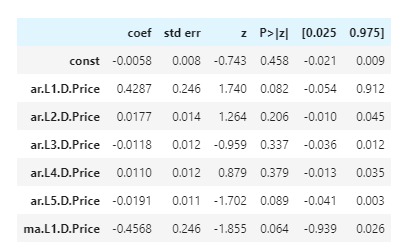
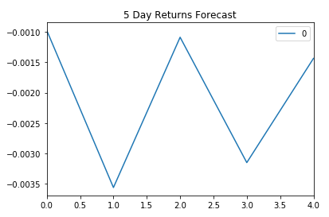
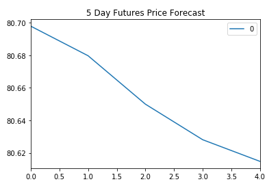
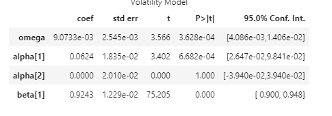
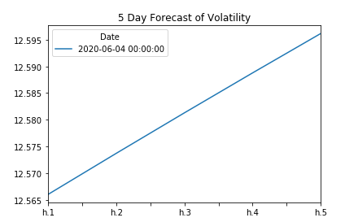
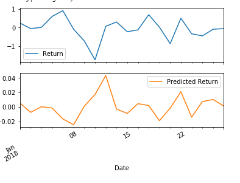

# Unit 10—A Yen for the Future

## Background

The financial departments of large companies often have to make foreign currency transactions when doing international business, while hedge funds are also interested in anything that will provide an edge in predicting currency movements. Hence, both are always eager to gain a better understanding of the future direction and risk of various currencies. 

In this assignment, you will test the many time series tools that you have learned in order to predict future movements in the value of the Canadian dollar versus the Japanese yen.

You will gain proficiency in the following tasks:

1. Time series forecasting
2. Linear regression modelling

- - -

### Files

[Time-Series Starter Notebook](Starter_Code/time_series_analysis.ipynb)

[Linear Regression Starter Notebook](Starter_Code/regression_analysis.ipynb)

[CAD/JPY Data CSV File](Starter_Code/cad_jpy.csv)

- - -

### Models & Findings

#### Hodrick-Prescott filter

After decomposing signal and noise from original historical data, it can be found that CAD/JPY long-term trend (2015-2020) is downward. In short-term (2016-2019), the currency pair is under consolidation and start to depreciate again from 2020.

#### ARMA & ARIMA

 

It is not very reliable to use the prediction results from ARMA and ARIMA model for trading. As from the summary table above, p-values of some coefficients in both models are larger than 0.05, which means that there is no relationship between the studied variable (one variable does not affect the other) and indicates they are not a good fit. 

 

#### GARCH

Our p-values for GARCH and volatility forecasts tend to be much lower than our ARMA/ARIMA return and price forecasts. In particular, here we have all p-values of less than 0.05, except for alpha(2), indicating overall a much better model performance.

According to predictions of GARCH model, the volatility of CAD/JPY will increase in the near future.

#### Linear Regression

This model predicts CAD/JPY returns with lagged CAD/JPY futures returns by building a linear regression relationship.

However, the results of out-of-sample RMSE is lower than the in-sample RMSE. RMSE is typically lower for training data, but is higher in this case which means it performs better for out-of-sample data and indicates an under-fit condition. 
