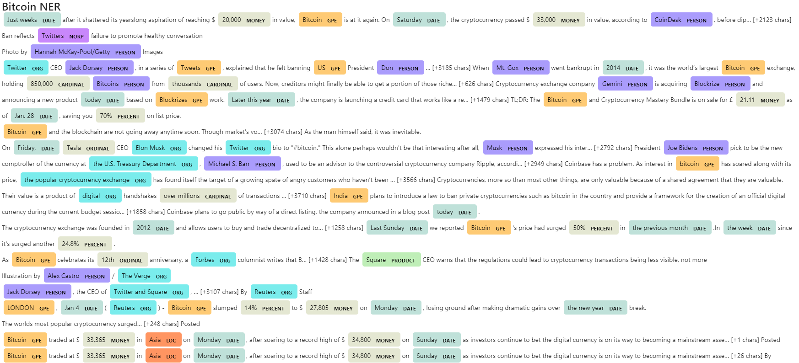
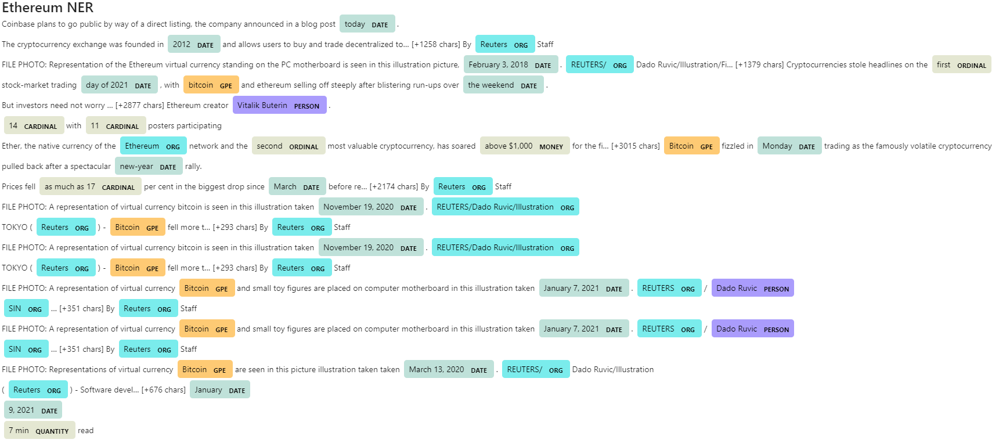

# Unit 12—Tales from the Crypto

## Background

There's been a lot of hype in the news lately about cryptocurrency, so I want to take stock, so to speak, of the latest news headlines regarding Bitcoin and Ethereum to get a better feel for the current public sentiment around each coin.

In this assignment, I will apply natural language processing to understand the sentiment in the latest news articles featuring Bitcoin and Ethereum. I will also apply fundamental NLP techniques to better understand the other factors involved with the coin prices such as common words and phrases and organizations and entities mentioned in the articles.

---

## Files

[NLP](NLP/crypto_sentiment.ipynb)

---

## Instructions

----

### 1 - Sentiment Analysis

Use the [newsapi](https://newsapi.org/) to pull the latest news articles for Bitcoin and Ethereum and create a DataFrame of sentiment scores for each coin.

It is found that 

* Bitcoin had the highest mean positive score at 0.0823.

* Bitcoin had the highest compound score at 0.9217.

* Bitcoin's max positive socre was higher which was 0.353.

---

### 2 - Natural Language Processing

In this section, NLTK and Python will be used to tokenize text, find n-gram counts, and create word clouds for both coins. 

#### Word Clouds

Generate word clouds for each coin to summarize the news for each coin.

---

### 3 - Named Entity Recognition

In this section, you will build a named entity recognition model for both coins and visualize the tags using SpaCy.

