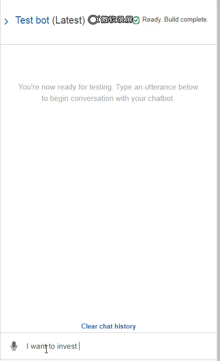

# Unit 13 Homework Assignment - The Power of the Cloud and Unsupervised Learning

## Task 1: Robo Advisor for Retirement Plans

*Photo by [Alex Knight](https://www.pexels.com/@alex-knight-1272316?utm_content=attributionCopyText&utm_medium=referral&utm_source=pexels) from [Pexels](https://www.pexels.com/photo/high-angle-photo-of-robot-2599244/?utm_content=attributionCopyText&utm_medium=referral&utm_source=pexels) | [Free License](https://www.pexels.com/photo-license/)*

### Background

You were hired as a digital transformation consultant by one of the most prominent retirement plan providers in the country; they want to increase their client portfolio, especially by engaging young people. Since machine learning and NLP are disrupting finance to improve customer experience, you decide to create a robo advisor that could be used by customers or potential new customers to get investment portfolio recommendations for retirement.

In this homework assignment, you will combine your new Amazon Web Services skills with your already mastered Python superpowers, to create a bot that will recommend an investment portfolio for a retirement plan.

You are asked to accomplish the following main tasks:

1. **[Initial Robo Advisor Configuration:](#Initial-Robo-Advisor-Configuration)** Define an Amazon Lex bot with a single intent that establishes a conversation about the requirements to suggest an investment portfolio for retirement.

2. **[Build and Test the Robo Advisor](#Build-and-Test-the-Robo-Advisor):** Make sure that your bot is working and responding accurately along with the conversation with the user, by building and testing it.

3. **[Enhance the Robo Advisor with an Amazon Lambda Function:](#Enhance-the-Robo-Advisor-with-an-Amazon-Lambda-Function)** Create an Amazon Lambda function that validates the user's input and returns the investment portfolio recommendation. This task includes testing the Amazon Lambda function and making the integration with the bot.

---

### Files

* [lambda_function.py](Starter_Files/lambda_function.py)
* [correct_dialog.txt](Test_Cases/correct_dialog.txt)
* [age_error.txt](Test_Cases/age_error.txt)
* [incorrect_amount_error.txt](Test_Cases/incorrect_amount_error.txt)
* [negative_age_error.txt](Test_Cases/negative_age_error.txt)

---

### Result

---

## Task 2: Clustering Crypto

_[Cryptocurrencies coins by Worldspectrum](https://www.pexels.com/@worldspectrum?utm_content=attributionCopyText&utm_medium=referral&utm_source=pexels) | [Free License](https://www.pexels.com/photo-license/)_

### Background

You are a Senior Manager at the Advisory Services team on a [Big Four firm](https://en.wikipedia.org/wiki/Big_Four_accounting_firms). One of your most important clients, a prominent investment bank, is interested in offering a new cryptocurrencies investment portfolio for its customers, however, they are lost in the immense universe of cryptocurrencies. They ask you to help them make sense of it all by generating a report of what cryptocurrencies are available on the trading market and how they can be grouped using classification.  

In this homework assignment, you will put your new unsupervivsed learning and Amazon SageMaker skills into action by clustering cryptocurrencies and creating plots to present your results.

You are asked to accomplish the following main tasks:

* **[Data Preprocessing](#Data-Preprocessing):** Prepare data for dimension reduction with PCA and clustering using K-Means.

* **[Reducing Data Dimensions Using PCA](#Reducing-Data-Dimensions-Using-PCA):** Reduce data dimension using the `PCA` algorithm from `sklearn`.

* **[Clustering Cryptocurrencies Using K-Means](#Clustering-Cryptocurrencies-Using-K-Means):** Predict clusters using the cryptocurrencies data using the `KMeans` algorithm from `sklearn`.

* **[Visualizing Results](#Visualizing-Results):** Create some plots and data tables to present your results.

* **[Optional Challenge](#Optional-Challenge):** Deploy your notebook to Amazon SageMaker.

---

### Results

* [crypto_clustering.ipynb](robo_adviser&crypto_cluster/crypto_clustering.ipynb)
* [crypto_clustering_sm.ipynb](robo_adviser&crypto_cluster/crypto_clustering_sm.ipynb)

