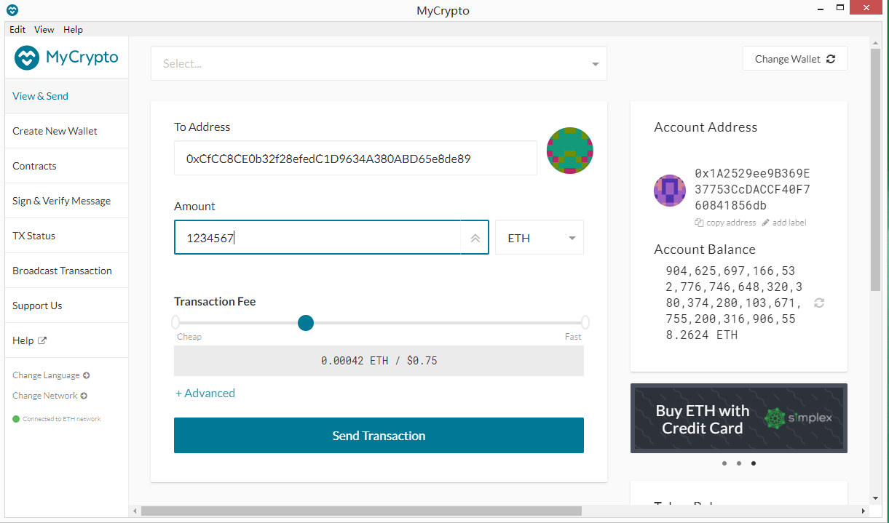

# Unit 18 | Homework Assignment: Building the Blockchain

The blockchain domain is rapidly changing.  Even those in a highly technical role must stay abreast of what is happening in the digital finance landscape as many FinTech companies are using and creating tools and services that are powered by blockchain. As a FinTech professional in these changing times, it's important to not only be aware of the advancements happening within the FinTech blockchain space, but to also understand the process for developing your very own blockchain.

This homework will be a two-part series in which I will first create a case study on a Canadian FinTech blockchain company. Then, you wil develop your very own blockchain.

## Blockchain Case Study

In this part, [Blockstream](Blockchain_Case_Study/Blockstream.md), a Canadian Bitcoin Blockchain company, has been studied. 

In this research, you will read:

* Background of Blockstream

* Current services and products it provides

* The financial and global impact 

* The concerns as well as criticism around Blockstream sidechain and mining service

## Proof of Authority Development Chain

For part two, I will set up a cutom testnet blockchain called paulhan and two nodes. Then a test transaction will be sent between these nodes. 

This blockchain is built up on POA and named paulhan. The blocktime is set as 5 seconds and its chain ID is 119. Both nodes password are password. 

In order for you to run this test net, you should download both of  [node one](POA_Development_Chain/node1) and [node two](POA_Development_Chain/node2) directories. You should also configure the [genesis block](POA_Development_Chain/paulhan/paulhan.json) on your computer in order to launch this test blockchain. The code of runing this blockchain is in [netword_commands](POA_Development_Chain/network_commands.txt). 

* node1 `geth` flag: "./geth --datadir node1 --unlock "1A2529ee9B369E37753CcDACCF40F760841856db" --mine --rpc --allow-insecure-unlock" 
* node2 `geth` flag: "./geth --datadir node2 --unlock "CfCC8CE0b32f28efedC1D9634A380ABD65e8de89" --mine --port 30304 --bootnodes "enode://6e56de96b156025bc9e8a1cca6aa63c31fd65da94bbba99cb218b5089732ae3505773d71705d252aa020606f519c2a32518912c3e3e2446ceda2e52629c06251@127.0.0.1:30303" --ipcdisable --allow-insecure-unlock"

After you seeing both nodes producing new blocks, MyCrypto GUI wallet is used  to connect to the node with the exposed RPC port. I have set up a cutom network, include the chain ID, and use ETH as the currency. The image below is a sreenshot of the parameters I used to setup this custom node. 

A test transaction is sent from node one to node two as shown in the image below.

And it is successfully mined by my nodes in around the same blocktime I set in the genesis. This transaction metadata (status, tx hash, block number, etc) is presented below. 

