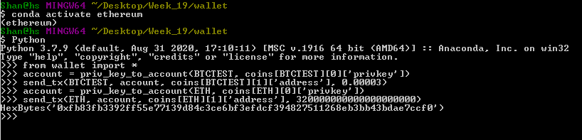
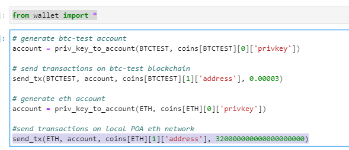
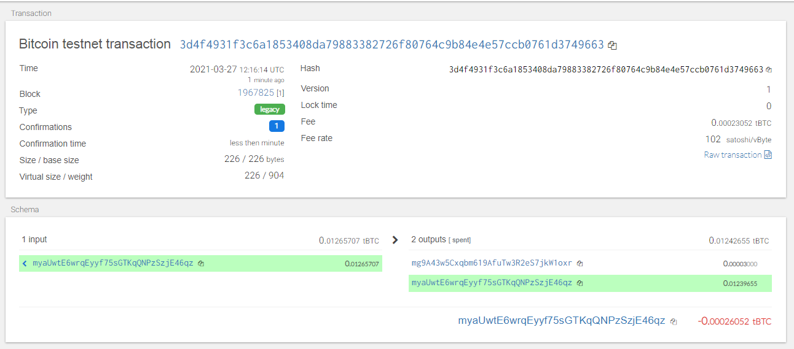
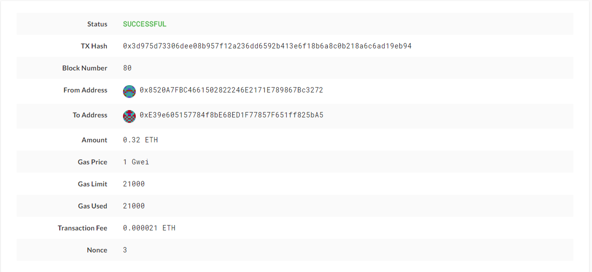

# Multi-Blockchain Wallet in Python

## Dependencies

- PHP must be installed on your operating system (any version, 5 or 7). Don't worry, you will *not* need to know any PHP.

- You will need to clone the [`hd-wallet-derive`](https://github.com/dan-da/hd-wallet-derive) tool.
  - Begin by opening a fresh terminal. Windows users must open their terminal as administator as follows:
    * Input C:\Program Files\Git\bin\bash.exe directly into the system search bar and launch the program as Administrator from the resulting menu.
    * This step is required or the installation will fail!
    * With your terminal open as indicated for your operating system, cd into your `Blockchain-Tools folder and run the following code:
    * git clone https://github.com/dan-da/hd-wallet-derive
    * cd hd-wallet-derive
    * curl https://getcomposer.org/installer -o installer.php
    * php installer.php
    * php composer.phar install

- [`bit`](https://ofek.github.io/bit/) Python Bitcoin library.

- [`web3.py`](https://github.com/ethereum/web3.py) Python Ethereum library.

## Instructions

After successfully setting up your virtrual environment, you can follow the steps below to send some transactions on both btc and eth testnet.

### Send some transactions!

Now, you should be able to fund these wallets using testnet faucets. Open up a new terminal window inside of `wallet`,
then run `python`. Within the Python shell, run `from wallet import *` — you can now access the functions interactively.
You'll need to set the account with  `priv_key_to_account` and use `send_tx` to send transactions.

In this way, you then can run the following command either in your git bash terminal window or Jupyter notebook to send some transactions on BTC-TEST and ETH network. 

 

#### Bitcoin Testnet transaction

- Fund a `BTCTEST` address using [this testnet faucet](https://coinfaucet.eu/en/btc-testnet/).

- Use a [block explorer](https://tbtc.bitaps.com/) to watch transactions on the address.

- Send a transaction to another testnet address (either one of your own, or the faucet's).

- Screenshot of the confirmation of the transaction

#### Local PoA Ethereum transaction

You should start to run a POA local blockchain called yy by using commands below:
* ./geth --datadir node1 --unlock "2ADa2B0F958d7C5C4bcC6834a7Cee1862dD72C7D" --mine --rpc --allow-insecure-unlock
* ./geth --datadir node2 --unlock "D40629c45138FD6f9cf7352fe85D85f6A0110aB2" --mine --port 30304 --bootnodes "enode://5cf310ee9fa03951cf882f3bb8b350a209cbee380501f50b2121f75213828b6c84e5e5188701330e9238d4c2383a4bdd93e97479bdab3568c40e1d2f3ce72929@127.0.0.1:30303" --ipcdisable --allow-insecure-unlock
* View your account in Mycrypto by using privation key of first eth address. 
* Denomination of send transaction value is Wei.

- Due to a bug in `web3.py`, you will need to send a transaction or two with MyCrypto first, since the
  `w3.eth.generateGasPrice()` function does not work with an empty chain. You can use one of the `ETH` address `privkey`,
  or one of the `node` keystore files.

- confirmation of transaction

