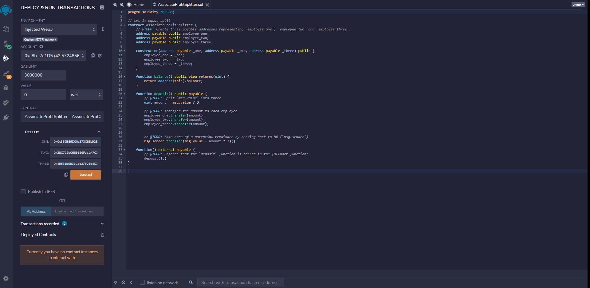
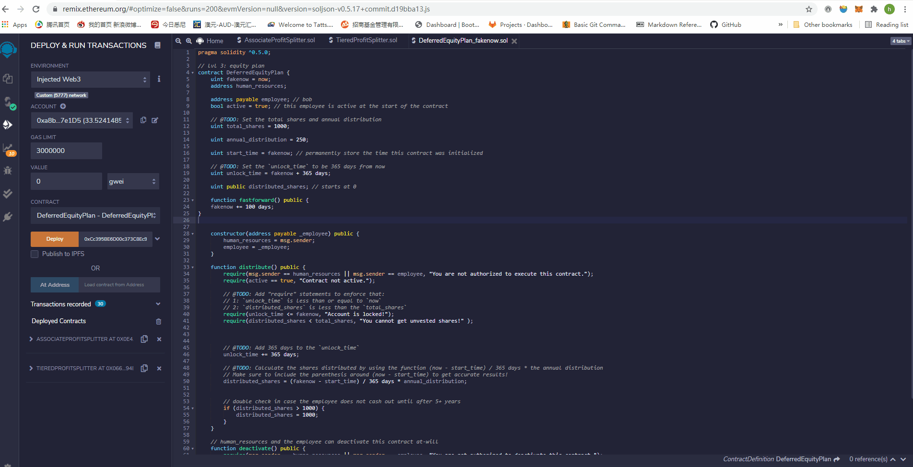

# Unit 20 - "Looks like we've made our first contract!"

## Background

Your new startup has created its own Ethereum-compatible blockchain to help connect financial institutions, and the team wants to build smart contracts to automate some company finances to make everyone's lives easier, increase transparency, and to make accounting and auditing practically automatic.

Fortunately, you've been learning how to program smart contracts with Solidity! What you will be doing this assignment is creating 3 `ProfitSplitter` contracts. These contracts will do several things:

* Pay your associate-level employees quickly and easily.

* Distribute profits to different tiers of employees.

* Distribute company shares for employees in a "deferred equity incentive plan" automatically.

## Files

* [`AssociateProfitSplitter.sol`](splitter/AssociateProfitSplitter.sol) — Level 1 contract.

* [`TieredProfitSplitter.sol`](splitter/TieredProfitSplitter.sol) — Level 2 contract.

* [`DeferredEquityPlan.sol`](splitter/DeferredEquityPlan.sol) — Level 3 contract.

* [`DeferredEquityPlan_fakenow.sol`](splitter/DeferredEquityPlan_fakenow.sol) — Level 3 test contract.

## Instructions

This assignment has three levels of difficulty, with each contract increasing in complexity and capability. 

* **Level One** is an `AssociateProfitSplitter` contract. This will accept ether into the contract, and divide it evenly among associate-level employees. This will allow the human resources department to pay employees quickly and efficiently.

* **Level Two** is a `TieredProfitSplitter` that will distribute different percentages of incoming ether to employees at different tiers/levels. For example, the CEO gets paid 60%, CTO 25%, and Bob gets 15%.

* **Level Three** is a `DeferredEquityPlan` that models traditional company stock plans. This contract will automatically manage 1000 shares, with an annual distribution of 250 shares over four years for a single employee.

### Projects

### Level One: The `AssociateProfitSplitter` Contract

In this contract, the ether will be distributed evenly into three associates wallets from human resource's account. 

### Level Two: The `TieredProfitSplitter` Contract

In this contract, rather than splitting the profits between associate-level employees, the ether will be distributed to different tiers of employees (CEO, CTO, and Bob) based on different percentages(60%, 25% and 15%).

### Level Three: The `DeferredEquityPlan` Contract

In this contract, we will be managing an employee's "deferred equity incentive plan," in which 1000 shares will be distributed over four years to the employee. We won't need to work with ether in this contract, but we will be storing and setting amounts that represent the number of distributed shares the employee owns, and enforcing the vetting periods automatically.

Because in the real contract, we set a threshold of 365 days for the employee to get his shares, it is impossible for us to wait for a year to test this contract. We use fakenow contract instead to test if this contract can work well.

### Deploy the contracts to a live Testnet

After switching MetaMask to Kovan, the contracts has been deployed, and  their deployed addresses are presented below. You can explore them on blockchain. 

* Associate Profit Spliter: 0xc747D48D22EABC76d4042616bEd83462c0130FFf
* Tiered Profit Spliter: 0xB3933c2543934A386284BFFF53985859c2Dd59d6
* Deferred Equity Plan: 0xdcD509e88901c63F2D93FDfAd605a638891999A7

