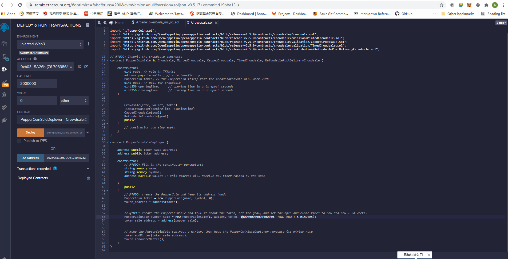
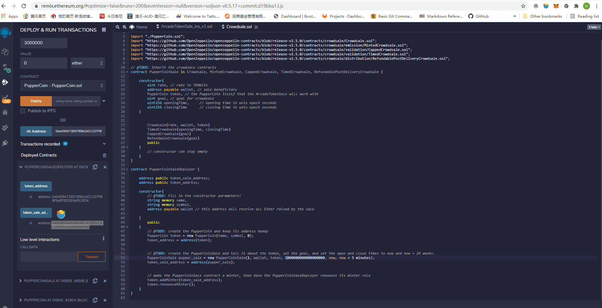
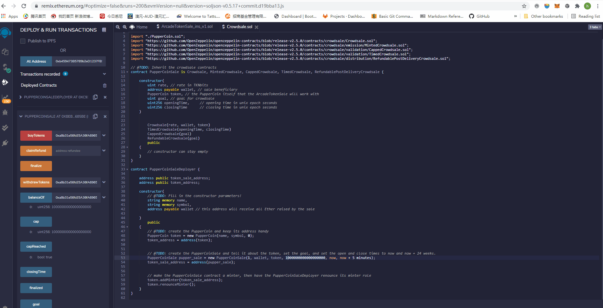
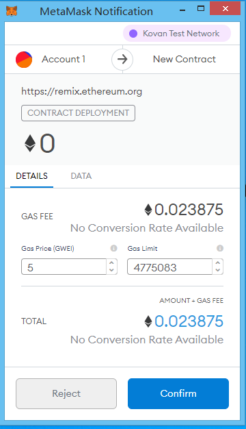

# Unit 21: You sure can attract a crowd!

_People in Concert - Photo by [Josh Sorenson](https://www.pexels.com/@joshsorenson?utm_content=attributionCopyText&utm_medium=referral&utm_source=pexels) | [Free License](https://www.pexels.com/license/)_

## Background

Your company has decided to crowdsale their PupperCoin token in order to help fund the network development.
This network will be used to track dog breeding activity across the globe in a decentralized way, and allow humans to track the genetic trail of their pets. You have already worked with the necessary legal bodies and obtained the green light on creating a crowdsale open to the public. However, you are required to enable refunds if the crowdsale is successful and the goal is met, and you are only allowed to raise a maximum of 300 ether. The crowdsale will run for 24 weeks.

## Files
* [PupperCoin](Puppercoin.sol) - a standard ERC20Mintable and ERC20Detailed contract
* [Crowdsale](Crowdsale.sol) - Crowdsale Deployment Contract

## Instructions

### Deploying and Testing the Crowdsale

Test the crowdsale by sending ether to the crowdsale from a different account (**not** the same account that is raising funds). I will test the time functionality by setting the `close` time to be `now + 5 minutes` and the goal as one ether instead of 300. 

### Adding token to Metamask 

You can follow the steps below to add your custom token to your metamask account and check balance. 

### Finalise 

After 5 minutes of testing, the contract can then be finalised and you can choose to withdraw your token if the goal is hit. If it is not, you can choose to get your ether back from refund function. 

### Deploying the Crowdsale

The contract has been deployed to the Kovan, and its address is 0xAaC621Bd6FAf8196c70B8c39D75029861138b111. 

Image below is the gas cost of deploying the crowdsale contract. 

