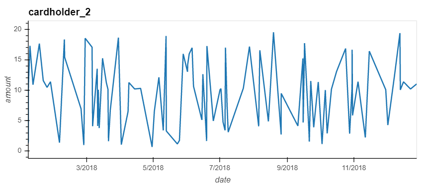
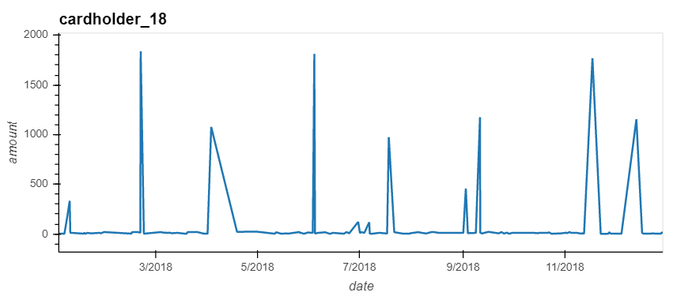
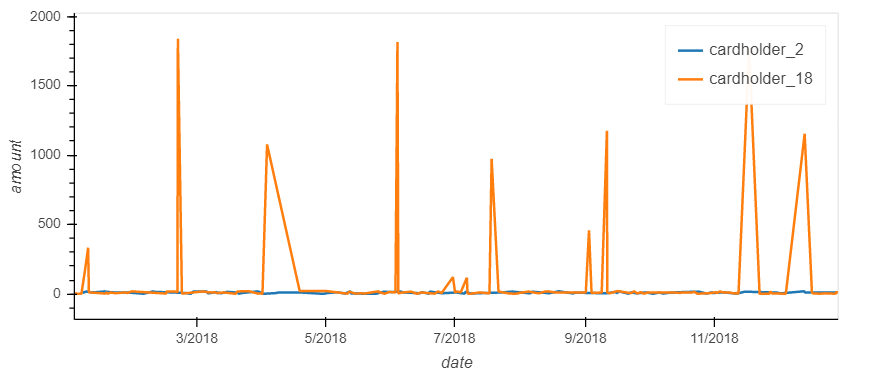
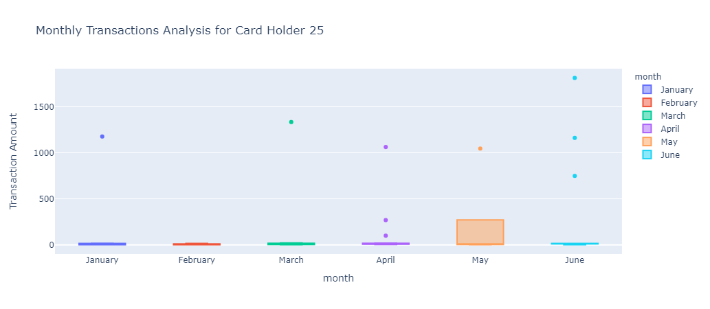

# Unit 7 Homework Assignment: Looking for Suspicious Transactions

## Data Engineering

Creating an entity relationship diagram(ERD) by applying [Quick Database Diagrams](https://www.quickdatabasediagrams.com) tool. Using PostgresSQL to analyse the database provided which generates files below

[cardholder_transactions_number.csv](Data/cardholder_transactions_number.csv)

[transactions_less_2.csv](Data/transactions_less_2.csv)

[top_100_transactions.csv](Data/top_100_transactions.csv)

[top_100_transactions_other.csv](Data/top_100_transactions_other.csv)

[top_5_merchants.csv](Data/top_5_merchants.csv)

## Data Analysis

[transactions_less_2.csv](Data/transactions_less_2.csv) file showcases the amount small transactions(less than $2.00) made by each cardholder. This file is generated by counting the number of transactions less than $2 and combining both credit_card.csv and transaction.csv. There are 25 people who made small transactions during 2018 among which 19 of them made more than 10 times and the largest number is 26. This is a signal suggests that these people's credit card may be hacked as fraudsters often test the hacked credit cards by making small amount of transactions first which are typically hard to notice by cardholder. Then they will make large amount of purchase by using this card. 

We also look at the top 100 largest transactions made between 7am to 9am, because we think any large amount of transactions(higher than $500) made in this time frame is very suspicious. In [top_100_transactions.csv](Data/top_100_transactions.csv), we find there were 9 transactions larger than $500 in 2018. Compare to this number in the rest of daytime which is 73, which means around 11% large transactions were made in these 2 hours. There must be a higher number of fraudulent transactions made between 7am and 9am, as people normally do not make decisions to buy expensive things during this time frame, so it needs deeper investigations. 

In [top_5_merchants.csv](Data/top_5_merchants.csv), Wood-Ramirez, Hood-Phillips, Baker Inc, 'Mcdaniel, Hines and Mcfarland' and Hamilton-Mcfarland are top five merchants more likely to be hacked by using small transactions 

## Visualization of Credit Fraud Analysis 

We combined [credit_card.csv](Data/credit_card.csv) and [transaction.csv](Data/transaction.csv) data to plot the consumption patterns of both cardholder 2 and 18. 

It can easily find that the transactions made by cardholder 2 fluctuated around a mean value, while the costs of cardholder_18 transactions is in a completely different pattern. It has much more outliers which are large transactions made after several small transcations. This pattern is a sign that this customer's credit card is very likely to be hacked. This conculsion can be observed more easily in the combined chart below.

A box plot for cardholder 25 transactions in first half year of 2018 is also created to see the outliers more conviniently. We can find there are nine outliers in this dataset and 7 of them were made after April. Moreover the amount of each transaction became much higher each month after April with the highest one ($1813) spend in June. This anomalies shows this people's card may be hacked since April 2018. 

